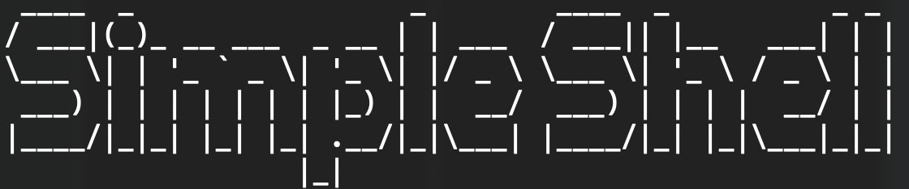

This is as very simple C shell, written for educational purposes
during the course of 3rd semester C classes with A. V. Stolyarov
at MSU CS Department 

Project consists of 5 C-files, each representing one feature added for 
the Shell:

--**Stage 1** - Building a base for the project  
--**Stage 2** - Adds _execvp_ command for execution on terminal 
--**Stage 3** - Adds support for _background run_ 
--**Stage 4** - Adds support for _i/o redirection_ 
--**Stage 5** - Adds the support of _pipeline_ 

Use for whatever purposes you want
